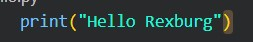

# Overview

This is a classic Hello World file. The purpose of this project was to set up my IDE on Visual Studio Code and connect it to GitHub.

{Provide a link to your YouTube demonstration.  It should be a one minute demo of the software running and a walkthrough of the code.}

[Software Demo Video](http://youtube.link.goes.here)

# Development Environment

* Python 3.10.1
* Visual Studio Code
* Git / GitHub

# Useful Websites

{Make a list of websites that you found helpful in this project}
* [Git Project Website](https://github.com/Aslan829/HelloWorld/blob/master/hello.py)
* [Web Site Name](http://url.link.goes.here)

